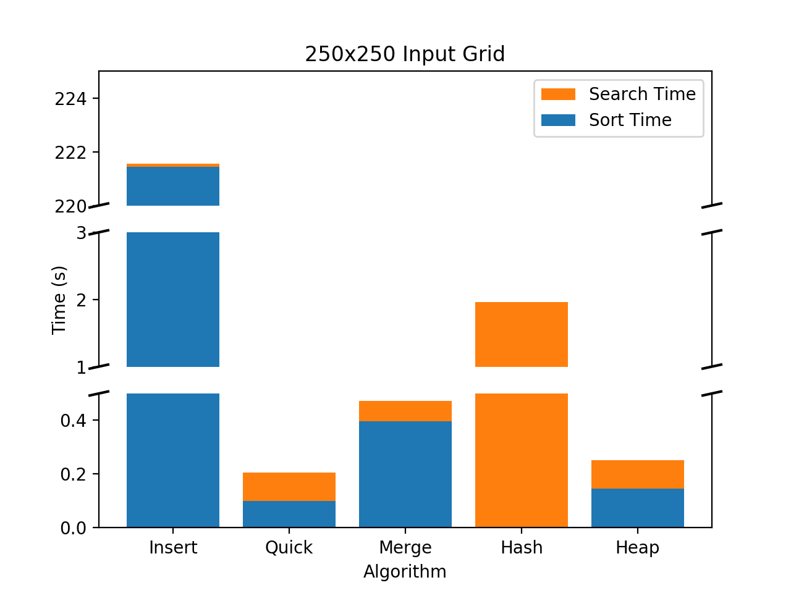
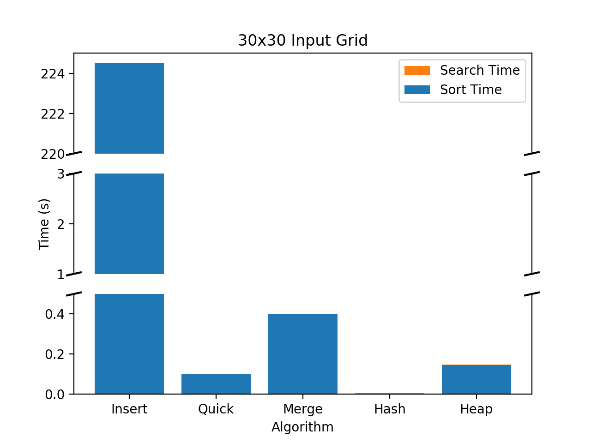

# Project 3: Word Search
Partner Project: Andrew Tu, Haley Weinstein

## Usage
- run `make` to build the Driver executable. 
- Executable will be produced in the **release** folder. 
- The executable in the **timing** folder will run all sort functions on all grids
using the wordlist2.cpp as input. 
- The executable in the **debug** folder has been compiled with debugging flags...
- You will be prompted to enter the file names for the grid file, the wordlist file 
and the sort mechanism you wish to use. 

**Make sure the name you enter is valid**: We do not check whether the name you give 
is a valid name. If you provide an invalid name, the program will likely hang. 
You can use the files from the data directory. Give the realtive path name. i.e.
"data/input250.txt"

- Sorts are as following
  1. Insertion
  2. Quick
  3. Merge
  4. STL
  5. Hash
  6. Heap 

## Performance
Timing data was collected for all sorting mechanisms on all grids using the 
wordlist2.txt file (approx 90k words). The results of each sorting algorithm can 
be seen in the following figure. 

The tests were run on a machine running Ubuntu 16.04 with 2 Intel Xeon X5650 
processors (total of 24 cores @ 2.67 Ghz). Multithreading was achieved using 24  
OpenMP threads. 

We saw a range of performances on total run time depending on the sorting algorithm 
used. Total run time was calculated as the Ttotal = Tsort + Tsearch. In the 
following sections, we explain differences in performances in the sort and search 
times.

### Sort
Each of the sorting algorithms behaved as expected.  Insertion sort ran very 
slowly ranging from 221.45 to 224.493 seconds whereas the quicksort ran in the 
range from .100246 to .100391 seconds and merge ran slightly slower than quicksort 
at .395506 to .3999265 seconds. This timing reflects the calculated different 
average case time scenarios. 

Hashing did not need to sort the data, thus its value can be interpretted as 0.

### Search
The high level view of our searching algorithm is as follows. For each character 
in our grid, search all 8 directions for words starting with that character. For
an NxN grid, this costs roughly N^3\*8(Lookup) where "Lookup" is the cost to determine
if a given word exists within our word list. This meant that as the problem size
scaled, search times would far outstrip sort times (the highest of which was X^2, 
if X is the size of a given wordList). This was also observed empirically where 
sorting wordlist2 took ~200s and (single threaded) searching took ~350 seconds. 

### Results
For algorithms where we organized data by sorting, we were able to significantly 
reduce our search time by performing lookups to see if words starting with a given 
string existed in our wordlist. If no word with existed with the gvien stem, we could 
stop searching a given direction and continue on the next direction. For example,
if the first 3 letters of a sequence were "xyz", and there weren't any words in 
our wordlist that started with "xyz", we could safely stop searching for more
words in this direction. In the case of the 250x250 grid, this meant not having 
to perform 247 more searches. Emplying this optimization saw a 230x improvement. 

Because we cannot perform a similar optimzation with our hash table, our search
using a hash table must search through the entire 250x250 grid. This difference in
performance is shown in the algorithmic complexity of the two searching algoritms:
the unsorted serach algorithm will always perform in n^3 time while the sorted 
algorithm ranges from best case n^2 time to worst case n^3. 

### Threading vs Algorithmic Complexity
This project also demonstrated an important concept in scalability. We improved 
performance by decreasing algorithmic complexity and by parallelizing our 
search algorithm. If we look at the impact each of these improvments had, we see 
that the perforamnce increase gained by improving our algorithmic complexity far
outstrips the performance boost from multithreading. 

By reducing the algorithmic complexity of the program, we reduce the amount of 
work we our program needs to do. By adding multithreading, we increase the amount 
of work our program can do per unit time. As our problem sizes grow larger and 
larger, the impact of reducing the work we need to do by a factor of `n` outstrips 
the speedup gained by multithreading. Furthermore, the speedup gained by multithreading
any applciation is limited by the number of available cores.

*TODO: Figure on performance*
